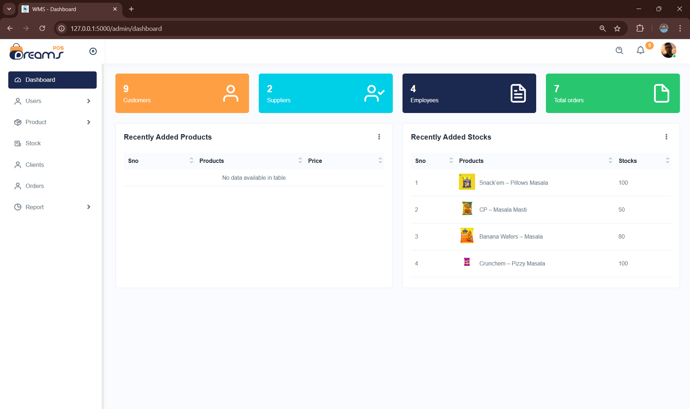
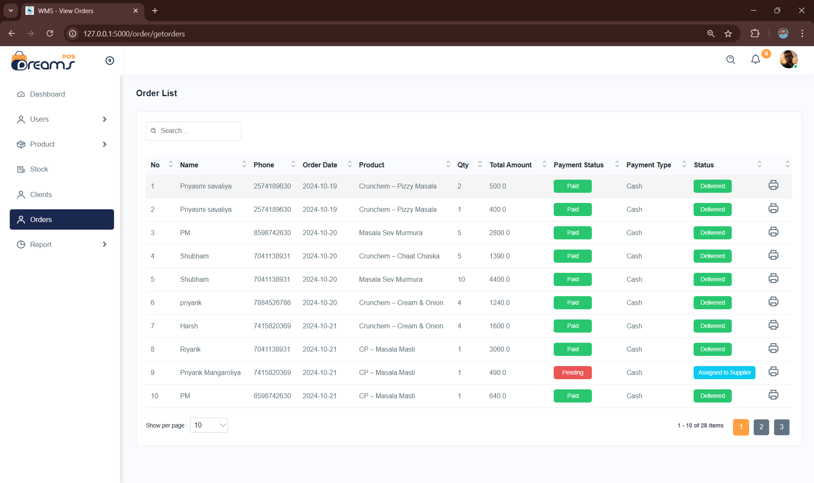

# Warehouse Management System

### 📄 Project Overview
The **Warehouse Management System (WMS)** is designed to improve warehouse operations, addressing common issues such as inaccurate inventory tracking, inefficient storage utilization, and delayed order processing. By automating tasks, the system ensures efficiency, accuracy, and enhanced productivity in a single warehouse environment.

---

### 🎯 Key Features
- **Real-time Inventory Tracking**: Monitor stock levels and updates in real time.
- **Automated Order Processing**: Streamline the order lifecycle from placement to dispatch.
- **Role-Based Access Control (RBAC)**:
  - **Admin**: Manage users, products, permissions, and generate reports.
  - **Manager**: Oversee inventory, orders, and workflows.
  - **Employee**: Handle assigned tasks, including picking and packing.
  - **Supplier**: Manage deliveries and payments.
  - **Client**: Place and track orders.
- **Detailed Analytics & Reports**: Make data-driven decisions with comprehensive insights.
- **Secure Operations**: Data encryption and role-based access ensure safety.

---

### 🛠️ Tech Stack
- **Frontend**: HTML, CSS, JavaScript
- **Backend**: Flask (Python)
- **Database**: MongoDB
- **Tools**: PyCharm, MongoDB Compass

---

### 🚀 Project Modules
1. **User Management**: Admins can create and manage user accounts with specific roles.
2. **Inventory Management**: Real-time stock monitoring and alerts for low inventory.
3. **Order Processing**: From creation to dispatch, with priority-based workflows.
4. **Picking & Packing**: Optimize picking paths and efficient packing processes.
5. **Shipping**: Generate labels and track shipments.
6. **Reporting**: Generate analytics on inventory and order performance.

---

### 🖼️ Application Snapshots

*For more screenshots, refer to the `/images` directory.*

---

### 📑 System Architecture
The system employs a modular architecture with separate layers for user interface, business logic, and data storage. Check the [System Design Documentation](./docs/system_architecture.md) for diagrams and details.

---

### 🧪 Testing
The system underwent rigorous testing:
- **Unit Testing**: Verified each module's functionality.
- **Integration Testing**: Ensured seamless module interactions.
- **Security Testing**: Assessed encryption and RBAC implementations.

---

### 🏆 Outcomes
- Enhanced warehouse efficiency.
- Accurate inventory and order fulfillment.
- Improved decision-making through analytics.

---

### 🌟 Future Enhancements
- Multi-warehouse management.
- Integration with ERP and IoT systems.
- AI for demand forecasting.
- Mobile application for on-the-go access.

---

### 📜 Authors
- **Shubham Lathiya** ([GitHub Profile](https://github.com/your-github))
- **Priyank Mangaroliya**

### 📚 References
- [IEEE Inventory Management](https://ieeexplore.ieee.org/document/278253)
- [Zoho Inventory Management](https://www.zoho.com/in/inventory/)
- [Kladana Inventory Management](https://www.kladana.com/product-tour/inventory-management/)
